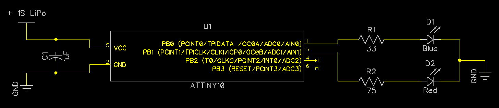

# Police Lights on ATtiny10

Lightweight hardware with Police Traffic Lights flashing patterns. 

Suitable for TinyWhoops or other tiny models. Weight is about 0.3 grams (depending on size and weight of your PCB).

Schematic ([DipTrace format](policeLightsWhoop.dch)):

PCB with LEDs, powered from 1S LiPo:

Whoop with PCB installed:

